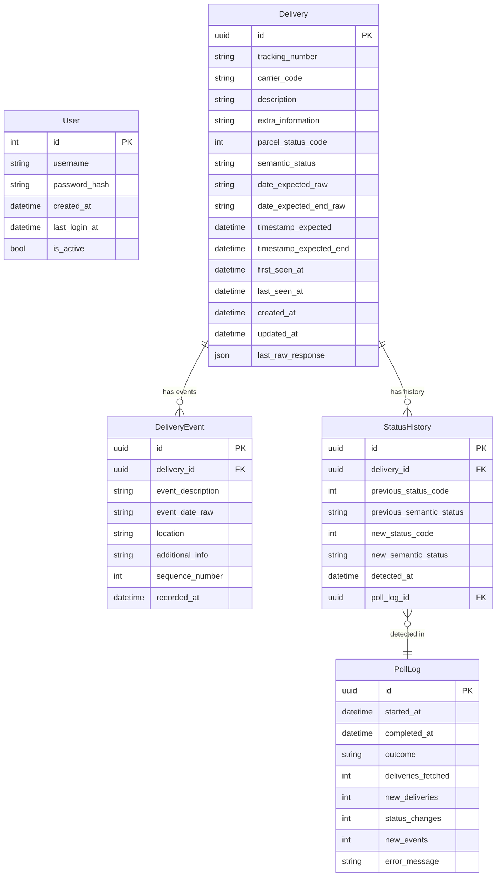

# Data Model Requirements

**Document ID**: DM-001  
**Plan Phase**: Phase 2  
**Status**: Draft — Awaiting Review  
**Project**: Delivery Tracking Web Service  
**Dependencies**: [01-architecture.md](./01-architecture.md)

---

## 1. Overview

The data model persists all information retrieved from the Parcel API, plus operational data for the service itself. Full history is retained indefinitely — no records are hard-deleted.

**Five entities**:

| Entity | Purpose |
|--------|---------|
| `Delivery` | One record per tracked package. The core business entity. |
| `DeliveryEvent` | Individual carrier scan/tracking events for a delivery. |
| `StatusHistory` | Immutable audit log of every status change detected by the poller. |
| `User` | Single-user credentials for dashboard access. |
| `PollLog` | Operational record of every Parcel API poll attempt. |

---

## 2. Entity Relationship Diagram



---

## 3. Entity Specifications

---

### 3.1 `Delivery`

Represents a single package being tracked. One record per unique `(tracking_number, carrier_code)` combination. Records are never deleted — once a delivery enters the system it is retained permanently.

#### Table: `deliveries`

| Column | Type | Nullable | Default | Constraints | Description |
|--------|------|----------|---------|-------------|-------------|
| `id` | `UUID` | No | `gen_random_uuid()` | PK | Internal surrogate key |
| `tracking_number` | `VARCHAR(255)` | No | — | Not null | Parcel tracking number |
| `carrier_code` | `VARCHAR(50)` | No | — | Not null | Parcel internal carrier code (e.g. `"ups"`) |
| `description` | `VARCHAR(500)` | No | `''` | Not null | User-supplied label from Parcel (e.g. `"Amazon - Laptop"`) |
| `extra_information` | `VARCHAR(500)` | Yes | `NULL` | — | Postcode, email, or other carrier-required auxiliary info |
| `parcel_status_code` | `SMALLINT` | No | — | Not null, check `0–8` | Raw integer status from Parcel API |
| `semantic_status` | `VARCHAR(50)` | No | — | Not null, see §4 | Normalized human-readable status enum value |
| `date_expected_raw` | `VARCHAR(50)` | Yes | `NULL` | — | Raw expected delivery date string from Parcel (no timezone). Display as-is. |
| `date_expected_end_raw` | `VARCHAR(50)` | Yes | `NULL` | — | Raw end-of-window date string (present when carrier gives a delivery window) |
| `timestamp_expected` | `TIMESTAMPTZ` | Yes | `NULL` | — | Epoch-derived UTC timestamp for expected delivery. Present only when carrier provides timezone. Preferred over `date_expected_raw` for sorting/calculations. |
| `timestamp_expected_end` | `TIMESTAMPTZ` | Yes | `NULL` | — | Epoch-derived UTC end of delivery window |
| `first_seen_at` | `TIMESTAMPTZ` | No | `NOW()` | Not null | Timestamp of the poll that first discovered this delivery |
| `last_seen_at` | `TIMESTAMPTZ` | No | `NOW()` | Not null | Timestamp of the most recent poll that returned this delivery |
| `created_at` | `TIMESTAMPTZ` | No | `NOW()` | Not null | Record creation timestamp |
| `updated_at` | `TIMESTAMPTZ` | No | `NOW()` | Not null | Last modification timestamp (updated on every poll that changes any field) |
| `last_raw_response` | `JSONB` | Yes | `NULL` | — | Full raw delivery JSON from the most recent Parcel API response. Useful for debugging and future field additions without schema migrations. |

#### Unique Constraint
```sql
UNIQUE (tracking_number, carrier_code)
```
This is the natural business key. A tracking number is unique within a carrier, but not globally — the composite is required.

#### Indexes
```sql
-- Primary key
PRIMARY KEY (id)

-- Business key lookup (upsert during polling)
UNIQUE INDEX uq_delivery_tracking ON deliveries (tracking_number, carrier_code)

-- Dashboard queries: filter/sort by status
INDEX idx_delivery_semantic_status ON deliveries (semantic_status)

-- Dashboard queries: sort by expected delivery date
INDEX idx_delivery_timestamp_expected ON deliveries (timestamp_expected NULLS LAST)

-- Polling: find recently updated deliveries
INDEX idx_delivery_last_seen ON deliveries (last_seen_at DESC)

-- Dashboard: most recently updated at top
INDEX idx_delivery_updated_at ON deliveries (updated_at DESC)
```

#### Business Rules
- **DM-BR-001**: `tracking_number` and `carrier_code` together uniquely identify a delivery. If a new poll returns a delivery matching an existing `(tracking_number, carrier_code)`, the existing record is **updated** (upserted), not duplicated.
- **DM-BR-002**: `description` is the user-supplied label from Parcel. It represents the **sender/package identity** shown on the dashboard. It is stored as-is and is not system-generated.
- **DM-BR-003**: When `timestamp_expected` is present, it MUST be used in preference to `date_expected_raw` for any sorting, calculations, or comparisons. `date_expected_raw` is timezone-naive and unreliable for ordering.
- **DM-BR-004**: `last_raw_response` is overwritten on every poll. It is NOT a history field — it reflects only the most recent API response. `StatusHistory` is the authoritative history store.
- **DM-BR-005**: Records are never hard-deleted. A delivery that no longer appears in Parcel API responses retains its last-known state. Its `last_seen_at` will fall behind the current time, which can be used to flag stale deliveries.

---

### 3.2 `DeliveryEvent`

Represents a single carrier scan or tracking event for a delivery. Events are immutable once written.

The Parcel API does not assign IDs to events. Deduplication is handled by the poller using a composite fingerprint (see §3.2 Business Rules).

#### Table: `delivery_events`

| Column | Type | Nullable | Default | Constraints | Description |
|--------|------|----------|---------|-------------|-------------|
| `id` | `UUID` | No | `gen_random_uuid()` | PK | Internal surrogate key |
| `delivery_id` | `UUID` | No | — | FK → `deliveries.id`, Not null | Parent delivery |
| `event_description` | `TEXT` | No | — | Not null | Event description text (e.g. `"Package arrived at facility"`) |
| `event_date_raw` | `VARCHAR(50)` | No | — | Not null | Raw date/time string from Parcel (no timezone). Display as-is. |
| `location` | `VARCHAR(255)` | Yes | `NULL` | — | Location string (e.g. `"London, UK"`) |
| `additional_info` | `TEXT` | Yes | `NULL` | — | Supplementary carrier information |
| `sequence_number` | `SMALLINT` | No | — | Not null | Position of this event in the events array as returned by Parcel (0-indexed). Lower = older. |
| `recorded_at` | `TIMESTAMPTZ` | No | `NOW()` | Not null | Timestamp when this event was first written to the database |

#### Deduplication Index (Natural Key)
```sql
UNIQUE INDEX uq_event_fingerprint ON delivery_events 
    (delivery_id, event_description, event_date_raw)
```
On insert, if the fingerprint already exists, the event is skipped (INSERT … ON CONFLICT DO NOTHING).

#### Indexes
```sql
PRIMARY KEY (id)

-- Deduplication / existence check during polling
UNIQUE INDEX uq_event_fingerprint ON delivery_events (delivery_id, event_description, event_date_raw)

-- Fetch all events for a delivery, ordered by position
INDEX idx_event_delivery_seq ON delivery_events (delivery_id, sequence_number ASC)
```

#### Business Rules
- **DM-BR-006**: Events are append-only. Once written, no event record is modified or deleted.
- **DM-BR-007**: Deduplication uses `(delivery_id, event_description, event_date_raw)` as a natural key. The poller uses `INSERT … ON CONFLICT DO NOTHING` to safely re-process repeated API responses.
- **DM-BR-008**: `sequence_number` reflects the order in which events appear in the Parcel API response array. The Parcel API returns events in chronological order (oldest first). `sequence_number` is used for stable display ordering.
- **DM-BR-009**: `event_date_raw` is stored as a string exactly as returned by Parcel. It is timezone-naive and must **not** be parsed into a timestamp for storage (parsing may be inaccurate without timezone context). It is displayed verbatim.

---

### 3.3 `StatusHistory`

An immutable audit log. One record is written every time the poller detects that `parcel_status_code` has changed for a delivery. This enables full lifecycle visibility and is the foundation for future notification features.

#### Table: `status_history`

| Column | Type | Nullable | Default | Constraints | Description |
|--------|------|----------|---------|-------------|-------------|
| `id` | `UUID` | No | `gen_random_uuid()` | PK | Internal surrogate key |
| `delivery_id` | `UUID` | No | — | FK → `deliveries.id`, Not null | Parent delivery |
| `previous_status_code` | `SMALLINT` | Yes | `NULL` | check `0–8` or null | Raw Parcel status code before the change. NULL for the initial status record. |
| `previous_semantic_status` | `VARCHAR(50)` | Yes | `NULL` | — | Semantic status before the change. NULL for initial record. |
| `new_status_code` | `SMALLINT` | No | — | Not null, check `0–8` | Raw Parcel status code after the change |
| `new_semantic_status` | `VARCHAR(50)` | No | — | Not null | Semantic status after the change |
| `detected_at` | `TIMESTAMPTZ` | No | `NOW()` | Not null | Timestamp when the poller detected this transition |
| `poll_log_id` | `UUID` | Yes | `NULL` | FK → `poll_logs.id` | The poll run during which this status change was detected |

#### Indexes
```sql
PRIMARY KEY (id)

-- Fetch full status timeline for a delivery
INDEX idx_status_history_delivery ON status_history (delivery_id, detected_at ASC)

-- Audit queries by time
INDEX idx_status_history_detected_at ON status_history (detected_at DESC)
```

#### Business Rules
- **DM-BR-010**: A `StatusHistory` record is written at delivery **creation** time (when a delivery is first seen), with `previous_status_code = NULL` and `previous_semantic_status = NULL`.
- **DM-BR-011**: On every subsequent poll where `parcel_status_code` differs from the stored value, a new `StatusHistory` record is written before the `Delivery` record is updated.
- **DM-BR-012**: `StatusHistory` records are immutable. No updates or deletions are permitted.
- **DM-BR-013**: The `detected_at` timestamp reflects when the system detected the change, not when the carrier changed the status. Carrier-side timing is not available from the Parcel API.

---

### 3.4 `User`

Stores credentials for the single authorized user. Exactly one record is expected. The table supports more records to allow future multi-user expansion without a schema change.

#### Table: `users`

| Column | Type | Nullable | Default | Constraints | Description |
|--------|------|----------|---------|-------------|-------------|
| `id` | `INTEGER` | No | `GENERATED ALWAYS AS IDENTITY` | PK | Surrogate key |
| `username` | `VARCHAR(100)` | No | — | Not null, Unique | Login username |
| `password_hash` | `VARCHAR(255)` | No | — | Not null | bcrypt hash of the password (cost factor ≥12) |
| `created_at` | `TIMESTAMPTZ` | No | `NOW()` | Not null | Account creation timestamp |
| `last_login_at` | `TIMESTAMPTZ` | Yes | `NULL` | — | Timestamp of last successful authentication. Updated on login. |
| `is_active` | `BOOLEAN` | No | `TRUE` | Not null | Whether this account can authenticate. Allows account suspension without deletion. |

#### Indexes
```sql
PRIMARY KEY (id)
UNIQUE INDEX uq_user_username ON users (username)
```

#### Business Rules
- **DM-BR-014**: Passwords are **never stored in plaintext**. Only bcrypt hashes (cost factor ≥ 12) are written to `password_hash`.
- **DM-BR-015**: The initial user account is seeded from `ADMIN_USERNAME` and `ADMIN_PASSWORD` environment variables on first run. The plaintext password env var is consumed and the hash stored; the env var should be removed or rotated after setup.
- **DM-BR-016**: `is_active = FALSE` prevents login without deleting the user record.
- **DM-BR-017**: User records are never deleted. Deactivation via `is_active` is the only supported removal mechanism.

---

### 3.5 `PollLog`

Operational record of every Parcel API poll cycle. Used for debugging, monitoring, and linking `StatusHistory` entries to specific poll runs.

#### Table: `poll_logs`

| Column | Type | Nullable | Default | Constraints | Description |
|--------|------|----------|---------|-------------|-------------|
| `id` | `UUID` | No | `gen_random_uuid()` | PK | Surrogate key |
| `started_at` | `TIMESTAMPTZ` | No | `NOW()` | Not null | When the poll cycle began |
| `completed_at` | `TIMESTAMPTZ` | Yes | `NULL` | — | When the poll cycle finished (NULL if still in progress or errored before completion) |
| `outcome` | `VARCHAR(20)` | No | — | Not null, check `('success','error','partial')` | Outcome: `success` = full run, `partial` = some deliveries processed before error, `error` = full failure |
| `deliveries_fetched` | `INTEGER` | Yes | `NULL` | check `≥0` | Count of deliveries returned by Parcel API |
| `new_deliveries` | `INTEGER` | Yes | `NULL` | check `≥0` | Count of deliveries seen for the first time |
| `status_changes` | `INTEGER` | Yes | `NULL` | check `≥0` | Count of status transitions detected |
| `new_events` | `INTEGER` | Yes | `NULL` | check `≥0` | Count of new `DeliveryEvent` records written |
| `error_message` | `TEXT` | Yes | `NULL` | — | Error detail when `outcome` is `error` or `partial` |

#### Indexes
```sql
PRIMARY KEY (id)

-- Retrieve recent poll history, most recent first
INDEX idx_poll_log_started_at ON poll_logs (started_at DESC)

-- Filter by outcome for error monitoring
INDEX idx_poll_log_outcome ON poll_logs (outcome)
```

#### Business Rules
- **DM-BR-018**: A `PollLog` record is created at the **start** of each poll cycle (before the Parcel API call), so incomplete runs are recorded even on hard failure.
- **DM-BR-019**: `completed_at` is set only on full or partial completion. A NULL `completed_at` indicates the process was interrupted before finishing.
- **DM-BR-020**: Poll logs are retained indefinitely. No archival or pruning policy is defined at this time.

---

## 4. Status Code to Semantic Status Mapping

The normalization layer maps Parcel's integer `status_code` to a `SemanticStatus` string enum. This mapping is defined in code (`services/normalization.py`) and is the single source of truth.

| Parcel `status_code` | `SemanticStatus` Value | Display Label | Lifecycle Group |
|---------------------|----------------------|---------------|-----------------|
| `0` | `DELIVERED` | Delivered | Terminal |
| `1` | `FROZEN` | Stalled | Terminal |
| `2` | `IN_TRANSIT` | In Transit | Active |
| `3` | `AWAITING_PICKUP` | Awaiting Pickup | Active |
| `4` | `OUT_FOR_DELIVERY` | Out for Delivery | Active |
| `5` | `NOT_FOUND` | Not Found | Attention |
| `6` | `DELIVERY_FAILED` | Delivery Failed | Attention |
| `7` | `EXCEPTION` | Exception | Attention |
| `8` | `INFO_RECEIVED` | Info Received | Active |

### Lifecycle Groups

| Group | Values | Meaning |
|-------|--------|---------|
| `ACTIVE` | `IN_TRANSIT`, `AWAITING_PICKUP`, `OUT_FOR_DELIVERY`, `INFO_RECEIVED` | Delivery is progressing normally |
| `ATTENTION` | `NOT_FOUND`, `DELIVERY_FAILED`, `EXCEPTION` | Requires user awareness |
| `TERMINAL` | `DELIVERED`, `FROZEN` | No further status changes expected |

### Business Rules
- **DM-BR-021**: `semantic_status` is derived from `parcel_status_code` using the mapping table above. It is stored in the `deliveries` table to enable database-level filtering without application-layer translation.
- **DM-BR-022**: An unrecognised `parcel_status_code` (i.e. outside 0–8) must not cause a poll failure. It must be stored as-is, and `semantic_status` should be set to the sentinel value `UNKNOWN`. An error is logged.
- **DM-BR-023**: `semantic_status` stored in `StatusHistory` is determined at write time and frozen. Future changes to the mapping table do not retroactively alter historical records.

---

## 5. Date and Timezone Handling

This is a known complexity area in the Parcel API response.

| Field | Source | Timezone | Storage Recommendation |
|-------|--------|----------|------------------------|
| `date_expected` | Parcel API | **None** | Store as raw `VARCHAR`. Display verbatim. |
| `date_expected_end` | Parcel API | **None** | Store as raw `VARCHAR`. Display verbatim. |
| `timestamp_expected` | Parcel API | **UTC (epoch)** | Convert to `TIMESTAMPTZ` on ingest. Use for sorting/filtering. |
| `timestamp_expected_end` | Parcel API | **UTC (epoch)** | Convert to `TIMESTAMPTZ` on ingest. |
| `event.date` | Parcel API | **None** | Store as raw `VARCHAR`. Display verbatim. |

- **DM-BR-024**: `timestamp_expected` MUST take precedence over `date_expected_raw` whenever it is present, for any date-based sort, filter, or display logic that requires temporal ordering.
- **DM-BR-025**: The service MUST NOT attempt to parse `date_expected_raw` or `event_date_raw` into timestamp values. These strings are carrier-formatted and inconsistently formatted across carriers.

---

## 6. Migration Strategy

Managed via **Alembic** with auto-generated revision scripts.

### Startup Sequence
```
Container starts
  → Alembic: run pending migrations (`alembic upgrade head`)
  → Seed script: if `users` table is empty, create initial user from env vars
  → APScheduler: start, trigger first poll immediately
  → Uvicorn: begin serving requests
```

### Migration Rules
- **DM-MIG-001**: Every schema change requires a new Alembic revision. Direct `ALTER TABLE` against the live database is prohibited.
- **DM-MIG-002**: Migrations must be **non-destructive** during normal operation. Column removals require a deprecation cycle (add `nullable`, stop writing, remove in a future migration).
- **DM-MIG-003**: The initial migration (`alembic revision --autogenerate`) creates all five tables, indexes, constraints, and check constraints defined in this document.
- **DM-MIG-004**: The seed script checks `SELECT COUNT(*) FROM users` and only runs if the result is `0`. It uses `ADMIN_USERNAME` and `ADMIN_PASSWORD` env vars. After seeding, it logs a warning if `ADMIN_PASSWORD` is still set in the environment.

---

## 7. Carrier Code Enrichment

The Parcel API returns `carrier_code` as an internal string (e.g. `"ups"`, `"royalmail"`). A human-readable carrier name is available from:

```
https://api.parcel.app/external/supported_carriers.json
```

This list is updated daily by Parcel.

### Decision: Client-Side Enrichment (Not Stored)

**DM-BR-026**: Carrier names are **not stored** in the database. The frontend is responsible for mapping `carrier_code` to a display name using a locally cached copy of `supported_carriers.json`, fetched via the REST API (see Phase 5 requirements). This avoids database bloat and keeps the mapping current without migrations.

> **Alternative considered**: A `carriers` lookup table populated by a periodic sync. Rejected as over-engineering for a single-user service — the carriers list can be fetched on dashboard load and cached in browser memory.

---

## 8. Data Volume Estimates

For planning and indexing adequacy:

| Entity | Estimated Records | Growth Rate |
|--------|------------------|-------------|
| `deliveries` | 50–500 at any time (active); unbounded history | Tens per month |
| `delivery_events` | 5–20 per delivery | Low |
| `status_history` | 2–6 per delivery lifecycle | Low |
| `users` | 1 | Static |
| `poll_logs` | 4/hr × 24hr × 365 = ~35,000/year | Steady |

This is a low-volume application. All proposed indexes are appropriate and will not negatively impact write performance.

---

*Source: Parcel API reference (//delivery-tracking/api-reference.md), user scoping input, architecture decisions (01-architecture.md)*  
*Traceability: DM-BR-001 through DM-BR-026, DM-MIG-001 through DM-MIG-004*
