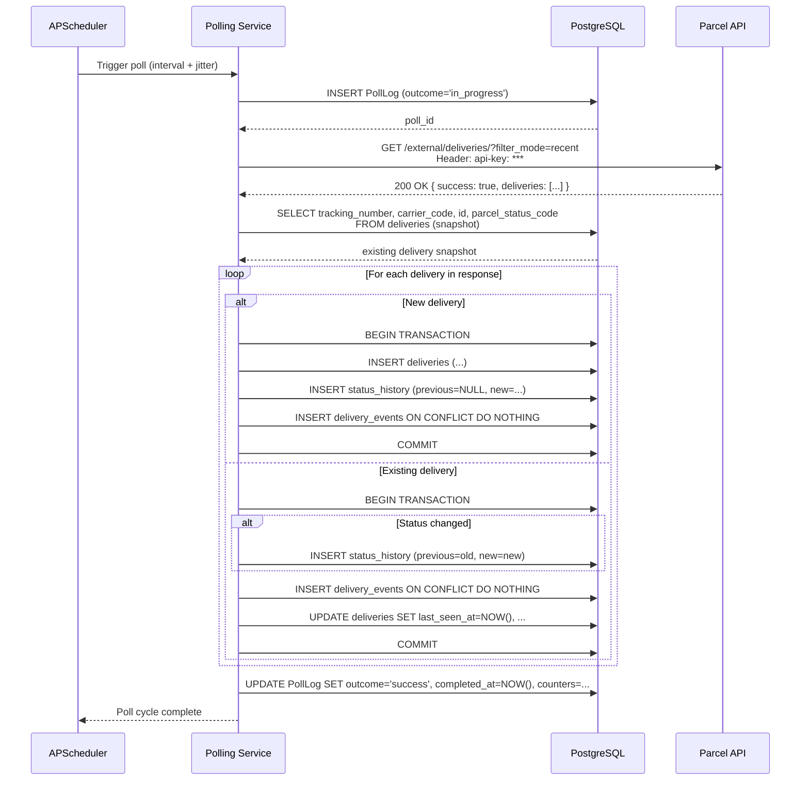
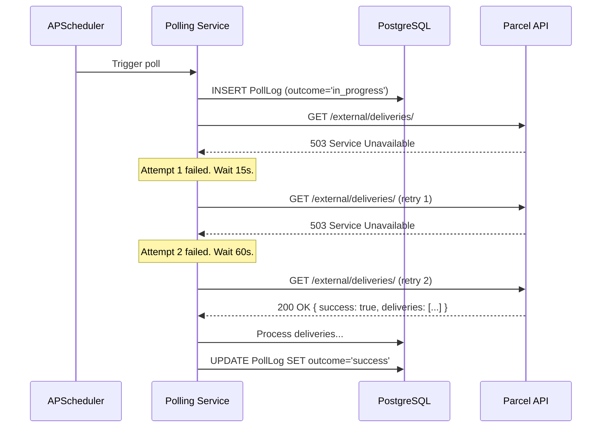

# Polling Service Requirements

**Document ID**: POLL-001  
**Plan Phase**: Phase 3  
**Status**: Draft — Awaiting Review  
**Project**: Delivery Tracking Web Service  
**Dependencies**: [01-architecture.md](./01-architecture.md), [02-data-model.md](./02-data-model.md)

---

## 1. Overview

The Polling Service is a background subsystem embedded within the FastAPI process. It is responsible for periodically calling the Parcel App API, comparing the response against persisted state, and writing all detected changes (new deliveries, status transitions, new events) to the database.

It runs as a scheduled job managed by **APScheduler**, integrated into the FastAPI application lifecycle via the `lifespan` context manager. No separate process or worker is required.

**Key responsibilities:**
- Schedule and execute polls against `GET /external/deliveries/`
- Enforce Parcel API rate limit compliance
- Detect new deliveries, status changes, and new events
- Persist all changes transactionally
- Record an operational `PollLog` for every poll cycle
- Handle errors and transient failures without crashing

---

## 2. Scheduling Requirements

### 2.1 Scheduler Technology

| Property | Value |
|----------|-------|
| Library | `APScheduler` ≥ 3.10 (`AsyncScheduler` variant) |
| Job type | `IntervalTrigger` |
| Interval | 15 minutes (configurable via `POLL_INTERVAL_MINUTES` env var) |
| Jitter | ±30 seconds random jitter applied to each scheduled execution |
| Max instances | 1 (prevent overlapping poll runs) |
| Misfire grace | 60 seconds (if the scheduler was paused/restarted and a trigger was missed within this window, execute immediately) |

### 2.2 Lifecycle Integration

The scheduler is managed inside the FastAPI `lifespan` async context manager:

```
Application startup:
  1. Initialise APScheduler
  2. Register polling job
  3. Start scheduler
  4. Immediately trigger first poll (cold-start requirement — see §2.3)
  5. Yield (application serves requests)

Application shutdown:
  1. Gracefully shut down scheduler
  2. Wait for any in-progress poll to complete (max 30s)
```

**POLL-REQ-001**: The scheduler MUST be started before the application begins serving HTTP requests, so that the first poll is triggered without a 15-minute delay on cold start.

**POLL-REQ-002**: On application shutdown, any in-progress poll cycle MUST be allowed to complete before the process exits, up to a maximum wait of 30 seconds. If the poll does not complete within 30 seconds, it is interrupted and the PollLog is marked `outcome = 'error'`.

### 2.3 Cold Start Behaviour

**POLL-REQ-003**: On every application start (including restarts), the poller MUST execute one poll immediately during the lifespan startup phase, before the first scheduled interval fires. This ensures:
- A fresh restart does not leave users waiting up to 15 minutes for current data
- Any status changes that occurred while the service was offline are captured promptly

**POLL-REQ-004**: The immediate cold-start poll MUST NOT count against the 15-minute interval timer. The next scheduled poll runs 15 minutes after the cold-start poll completes (not 15 minutes after startup).

### 2.4 Interval Configuration

**POLL-REQ-005**: The polling interval MUST be configurable via the `POLL_INTERVAL_MINUTES` environment variable (default: `15`). The minimum permitted value is `5` minutes. Values below 5 minutes MUST be rejected at startup with a logged error and the default applied.

**POLL-REQ-006**: At the default 15-minute interval, the service makes approximately **4 requests per hour** against the Parcel API's 20 req/hr rate limit — consuming 20% of the allowance and leaving an 80% safety margin. This margin accommodates manual retries and future features.

---

## 3. API Key Management

**POLL-REQ-007**: The Parcel API key MUST be read exclusively from the `PARCEL_API_KEY` environment variable via `pydantic-settings`. It MUST NOT be hardcoded, stored in the database, or written to any log file.

**POLL-REQ-008**: On application startup, if `PARCEL_API_KEY` is absent or empty, the application MUST log a `CRITICAL` level error and refuse to start.

**POLL-REQ-009**: The API key MUST NOT appear in:
- Log output (even at DEBUG level)
- HTTP response bodies or headers from the service
- Error messages surfaced to the dashboard API

**POLL-REQ-010**: The API key is passed to the Parcel API as the `api-key` HTTP request header on every poll call. No other authentication mechanism is used with the Parcel API.

---

## 4. Parcel API Invocation

### 4.1 HTTP Client Configuration

| Property | Value |
|----------|-------|
| Library | `httpx` (async) |
| Base URL | `https://api.parcel.app` |
| Endpoint | `GET /external/deliveries/?filter_mode=recent` |
| Timeout | 30 seconds (connect + read combined) |
| Retries | Handled explicitly (see §6) — `httpx` automatic retries disabled |
| TLS | System trust store; HTTPS required; certificate verification enabled |

**POLL-REQ-011**: The poll MUST use `filter_mode=recent` (not `active`). The `recent` filter returns the broadest set of deliveries, including those that completed recently, ensuring the service captures terminal status transitions (e.g. `IN_TRANSIT → DELIVERED`) before a delivery ages out of the Parcel API response window.

**POLL-REQ-012**: The HTTP client instance MUST be shared across poll cycles (not re-created per poll) to enable HTTP/1.1 keep-alive connection reuse.

### 4.2 Response Validation

**POLL-REQ-013**: Before processing, every Parcel API response MUST be validated as follows:

```
1. HTTP status code is 2xx        → proceed
   HTTP status code is 429        → rate limit handling (§6.2)
   HTTP status code is 4xx (other)→ non-retryable error (§6.3)
   HTTP status code is 5xx        → retryable error (§6.4)

2. Response body is valid JSON    → proceed
   Response body is not JSON      → treat as 5xx retryable error

3. success == true                → proceed
   success == false               → log error_message, mark poll as error, do not process deliveries
```

**POLL-REQ-014**: An empty `deliveries` array (when `success == true`) is a valid response and MUST NOT be treated as an error. It means Parcel has no recent deliveries for the account.

---

## 5. Change Detection & Processing Algorithm

This is the core logic of the polling service. It runs after a successful Parcel API response is received.

### 5.1 Overview

```
Poll cycle execution:
  ┌─────────────────────────────────────────────────────┐
  │ 1. Create PollLog record (outcome = 'in_progress')  │
  │ 2. Call Parcel API → get deliveries list            │
  │ 3. Load existing state snapshot from DB             │
  │ 4. For each delivery in response:                   │
  │    a. Classify: new OR existing                     │
  │    b. If new      → INSERT delivery + status + events│
  │    c. If existing → diff against snapshot           │
  │       i.  Status changed?  → write StatusHistory    │
  │       ii. New events?      → INSERT new events      │
  │       iii.Update delivery record (always)           │
  │ 5. Update PollLog (outcome = 'success', counters)   │
  └─────────────────────────────────────────────────────┘
```

### 5.2 Pre-Poll State Snapshot

**POLL-REQ-015**: Before processing any delivery from the API response, the poller MUST load a snapshot of all existing deliveries from the database in a single query:

```sql
SELECT tracking_number, carrier_code, id, parcel_status_code
FROM deliveries
```

This snapshot is held in memory for the duration of the poll cycle and used for O(1) lookups during delivery processing. It avoids N+1 query patterns.

### 5.3 New Delivery Detection

**POLL-REQ-016**: A delivery is considered **new** if its `(tracking_number, carrier_code)` pair does not exist in the pre-poll snapshot.

**For a new delivery, the poller MUST:**
1. `INSERT` a `Delivery` record with all fields from the API response, `first_seen_at = NOW()`, `last_seen_at = NOW()`
2. `INSERT` a `StatusHistory` record with `previous_status_code = NULL`, `previous_semantic_status = NULL`, `new_status_code` and `new_semantic_status` from the delivery
3. `INSERT` all events from the delivery's `events` array as `DeliveryEvent` records, with `sequence_number` matching their array index

### 5.4 Existing Delivery Processing

**POLL-REQ-017**: A delivery is **existing** if its `(tracking_number, carrier_code)` is found in the pre-poll snapshot.

**For an existing delivery, the poller MUST:**

#### Status Change Check
- Compare `api_response.status_code` to `snapshot.parcel_status_code`
- If **different**:
  1. `INSERT` a `StatusHistory` record capturing the old and new values
  2. Increment the `status_changes` counter for the PollLog

#### Event Diff
- For each event in `api_response.events`:
  - Attempt `INSERT INTO delivery_events … ON CONFLICT (delivery_id, event_description, event_date_raw) DO NOTHING`
  - If the insert succeeded (rows affected = 1): increment `new_events` counter
  - If it was a no-op (conflict): event already recorded, skip

#### Delivery Record Update
Regardless of whether status or events changed, **always** update:
- `last_seen_at = NOW()`
- `updated_at = NOW()`
- All mutable fields that may have changed: `description`, `extra_information`, `date_expected_raw`, `date_expected_end_raw`, `timestamp_expected`, `timestamp_expected_end`, `parcel_status_code`, `semantic_status`, `last_raw_response`

**POLL-REQ-018**: The delivery record update MUST be executed even when no status change or new events are detected. `last_seen_at` must always reflect the most recent poll that returned this delivery.

### 5.5 Transaction Boundaries

**POLL-REQ-019**: Each individual delivery's database operations (delivery upsert + status history insert + event inserts) MUST be wrapped in a single database transaction. If any operation within a delivery's transaction fails, that delivery's changes are rolled back and the error is logged. Processing continues with the remaining deliveries in the response.

**POLL-REQ-020**: The PollLog record MUST be updated (final outcome, counters) in a separate transaction after all delivery processing is complete. This ensures the PollLog accurately reflects the final result even if individual delivery transactions were partially rolled back.

**POLL-REQ-021**: Deliveries in the API response MUST be processed sequentially (not in parallel). Parallel processing is not required at this data volume and introduces transaction complexity without benefit.

### 5.6 Semantic Status Derivation

**POLL-REQ-022**: The `semantic_status` value is derived from `parcel_status_code` using the mapping defined in `DM-BR-021` (data model §4). This derivation MUST be applied consistently:
- At new delivery INSERT time
- At every existing delivery UPDATE where `parcel_status_code` has changed
- The mapping function resides in `services/normalization.py` and is the single source of truth

**POLL-REQ-023**: An unrecognised `parcel_status_code` (outside 0–8) MUST NOT cause the poll to fail. The delivery is processed normally with `semantic_status = 'UNKNOWN'`. A `WARNING` level log entry is emitted including the tracking number and the unrecognised code.

---

## 6. Error Handling & Retry Strategy

### 6.1 Error Classification

| Error Type | Examples | Strategy |
|-----------|----------|----------|
| Rate limited | HTTP 429 | Back off, skip this cycle, do not retry |
| Auth failure | HTTP 401, `success=false` with auth error | Log CRITICAL, skip this cycle, do not retry, alert operator |
| Client error | HTTP 400, 403, 404 | Log ERROR, skip this cycle, do not retry |
| Server error | HTTP 500, 502, 503, 504 | Retry with exponential backoff (see §6.4) |
| Network error | Connection refused, DNS failure, timeout | Retry with exponential backoff (see §6.4) |
| Invalid JSON | Malformed response body | Treat as server error, retry |
| Parcel logical error | `success=false` with error_message | Log ERROR, skip this cycle, do not retry |

### 6.2 Rate Limit Handling (HTTP 429)

**POLL-REQ-024**: On receiving HTTP 429 from the Parcel API:
1. Log a `WARNING`: `"Parcel API rate limit exceeded. Skipping poll cycle."`
2. Mark PollLog `outcome = 'error'`, `error_message = 'Rate limited (HTTP 429)'`
3. Do **not** retry within this cycle
4. The next poll cycle runs at the normal scheduled interval (15 min), which will have reset the rate limit window

> At 4 req/hr for normal polling, a 429 would indicate an external actor is also consuming the API key's quota, or the polling interval has been misconfigured below the minimum.

### 6.3 Auth Failure (HTTP 401)

**POLL-REQ-025**: On receiving HTTP 401 from the Parcel API:
1. Log a `CRITICAL`: `"Parcel API authentication failed. Check PARCEL_API_KEY configuration."`
2. Mark PollLog `outcome = 'error'`
3. Do **not** retry — further retries would just repeat the auth failure
4. The scheduler continues to run future polls (the key may be rotated by the operator)

### 6.4 Retryable Errors (5xx / Network)

**POLL-REQ-026**: On encountering a retryable error (HTTP 5xx or network-level failure):

| Attempt | Delay Before Retry |
|---------|--------------------|
| 1st retry | 15 seconds |
| 2nd retry | 60 seconds |
| 3rd retry | 120 seconds |
| After 3rd failure | Give up; mark PollLog `outcome = 'error'` |

**POLL-REQ-027**: Retry attempts MUST be logged at `WARNING` level, including attempt number, error type, and delay before next attempt.

**POLL-REQ-028**: The total time spent retrying within a single poll cycle MUST NOT exceed 10 minutes. If the retry sequence would exceed this budget, the cycle is abandoned and the next scheduled poll is relied upon.

### 6.5 Partial Delivery Failures

**POLL-REQ-029**: If an individual delivery's database transaction fails (e.g. unexpected DB error, constraint violation), the poller MUST:
1. Roll back that delivery's transaction
2. Log the error at `ERROR` level with tracking number and carrier code
3. Continue processing the remaining deliveries in the response
4. Mark PollLog `outcome = 'partial'` (not `'success'`) if any delivery failed

**POLL-REQ-030**: A partial success (some deliveries processed, some failed) MUST be clearly distinguishable in the PollLog from a full success. The `outcome = 'partial'` value serves this purpose.

### 6.6 Database Unavailability

**POLL-REQ-031**: If the database is unavailable at poll time (connection refused, pool exhausted):
1. Log `ERROR`: `"Database unavailable during poll cycle"`
2. Abort the poll cycle entirely (no Parcel API call is made)
3. Mark the in-memory state as failed (if a PollLog record could not be written, this is best-effort)
4. The scheduler continues; the next poll cycle will attempt the DB connection again

---

## 7. Concurrency & Overlap Prevention

**POLL-REQ-032**: APScheduler MUST be configured with `max_instances=1` for the polling job. If a scheduled trigger fires while a previous poll cycle is still running, the new trigger is **dropped** (not queued). A `WARNING` is logged: `"Poll cycle skipped — previous cycle still running"`.

> At a 15-minute interval and typical Parcel API response times of under 5 seconds, poll overlap should never occur under normal conditions. This guard handles degraded scenarios (slow DB, long retry sequences).

---

## 8. Logging Requirements

All polling activity MUST be logged using structured logging at the following levels:

| Event | Level | Required Fields |
|-------|-------|----------------|
| Poll cycle started | `INFO` | `poll_id`, `scheduled_at` |
| Parcel API call made | `DEBUG` | `filter_mode`, `url` |
| Parcel API response received | `DEBUG` | `status_code`, `deliveries_count`, `duration_ms` |
| New delivery discovered | `INFO` | `tracking_number`, `carrier_code`, `semantic_status` |
| Status change detected | `INFO` | `tracking_number`, `carrier_code`, `previous_status`, `new_status` |
| Poll cycle completed | `INFO` | `poll_id`, `outcome`, `deliveries_fetched`, `new_deliveries`, `status_changes`, `new_events`, `duration_ms` |
| Retryable error | `WARNING` | `attempt`, `error_type`, `message`, `retry_delay_seconds` |
| Rate limit hit | `WARNING` | `poll_id` |
| Auth failure | `CRITICAL` | `poll_id`, `http_status` |
| Unrecognised status code | `WARNING` | `tracking_number`, `carrier_code`, `status_code` |
| Individual delivery failure | `ERROR` | `tracking_number`, `carrier_code`, `error` |
| Poll cycle failed | `ERROR` | `poll_id`, `error` |

**POLL-REQ-033**: The Parcel API key MUST NOT appear in any log output. Log the presence or absence of the key, not its value.

**POLL-REQ-034**: Each poll cycle MUST be assigned a unique `poll_id` (the `PollLog.id` UUID) at creation. All log entries within a poll cycle MUST include this ID to enable log correlation.

---

## 9. Health & Observability

**POLL-REQ-035**: The REST API MUST expose a health endpoint (see Phase 5) that includes the following polling service indicators:

| Indicator | Source | Description |
|-----------|--------|-------------|
| `last_poll_at` | `PollLog.started_at` (most recent) | Timestamp of the most recent poll attempt |
| `last_poll_outcome` | `PollLog.outcome` (most recent) | `success`, `partial`, or `error` |
| `last_successful_poll_at` | `PollLog.started_at` where `outcome='success'` | Most recent fully successful poll |
| `scheduler_running` | APScheduler state | Boolean: is the scheduler running? |
| `consecutive_errors` | Computed from recent PollLog records | Count of consecutive error outcomes |

**POLL-REQ-036**: If `consecutive_errors` reaches 3 or more, the health endpoint MUST return a degraded health status indicator (not necessarily HTTP 503, but the health payload must flag it).

---

## 10. Configuration Reference

| Variable | Type | Default | Required | Description |
|----------|------|---------|----------|-------------|
| `PARCEL_API_KEY` | string | — | ✅ | Parcel App API key |
| `POLL_INTERVAL_MINUTES` | integer | `15` | No | Polling interval in minutes (min: 5) |
| `POLL_JITTER_SECONDS` | integer | `30` | No | Max jitter in seconds added to each interval |
| `POLL_HTTP_TIMEOUT_SECONDS` | integer | `30` | No | Parcel API HTTP request timeout |
| `POLL_MAX_RETRIES` | integer | `3` | No | Max retry attempts for transient errors |

---

## 11. Sequence Diagram — Normal Poll Cycle



---

## 12. Sequence Diagram — Retryable Error



---

*Source: Parcel API reference (//delivery-tracking/api-reference.md), data model (02-data-model.md), architecture (01-architecture.md), user scoping input*  
*Traceability: POLL-REQ-001 through POLL-REQ-036*
